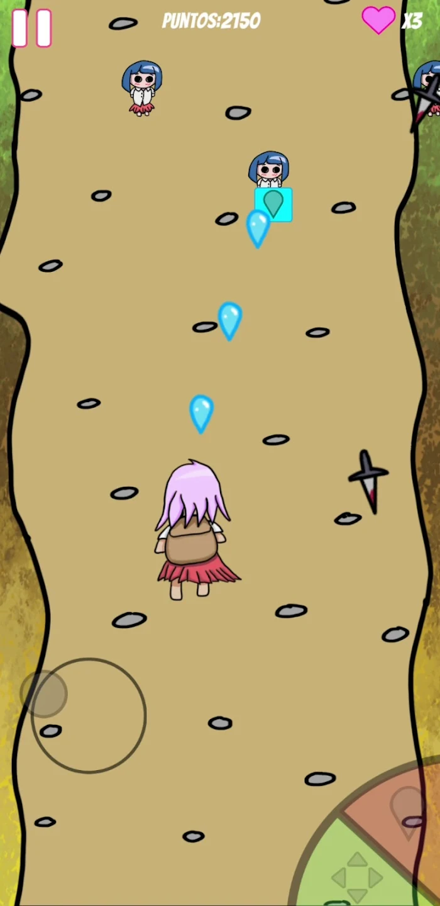

<h1>Kawaii Nightmares</h1>

My second published game on Google Play, where I focused on text localization. Although there are now open-source repositories for this, I wanted to learn it on my own.

This project was created for learning purposes.

If you wanna test it you can play it.
<h2>Controls</h2>
Move: tap wherever on the screen to generate a joystick 
Shoot: red button.  
Change Movement: Green button  

<h2>Objective</h2>
Survive all time that you can

<h2>Image</h2>

